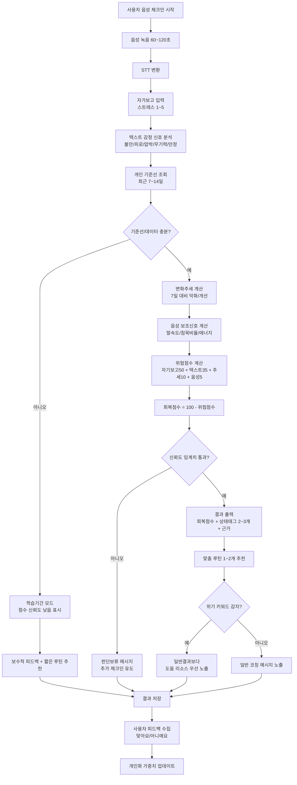

# 상태분석 작동 플로우
작성일: `2026-04-17`

## 1) 플로우차트 (Mermaid)

## 2) 텍스트 단계 요약
1. 사용자가 60~120초 음성 체크인을 녹음한다.
2. 음성을 STT로 텍스트 변환하고, 스트레스 자기보고(1~5)를 함께 받는다.
3. 텍스트 감정 신호를 주신호로 분석하고, 음성 특성은 보조신호로만 사용한다.
4. 개인 기준선(최근 7~14일)과 비교해 오늘의 변화량을 계산한다.
5. 위험점수(`자기보고50 + 텍스트35 + 추세10 + 음성5`)를 계산한다.
6. 회복점수(`100 - 위험점수`)를 산출한다.
7. 신뢰도 임계치를 통과하지 못하면 판단보류 메시지를 출력한다.
8. 통과하면 점수/태그/근거와 맞춤 루틴을 제공한다.
9. 위기 키워드가 감지되면 일반 결과보다 도움 리소스를 우선 노출한다.
10. 사용자 피드백(맞아요/아니에요)로 개인화 가중치를 업데이트한다.
